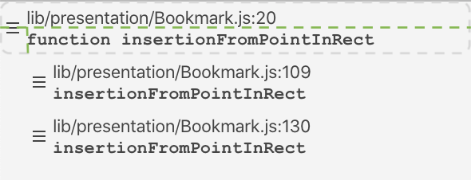

# casefile package

The essential assistant for deep-dives in code

Casefile is a bookmark manager on steroids, including:

* A _Casefile_ tab that displays all bookmarks in the project
* Bookmarks that include text to find at (or around) the designated location
* Drag-and-drop reordering and hierarchical organization of bookmarks
* User-supplied notes on bookmarks
* Bookmark locations linked to specific commits (for Git-managed projects), allowing the bookmarked text to be located even after the file is modified
* Export to and import from text, allowing collaboration or preservation in a ticketing system

## Hierarchical Organization

When dragging a bookmark, you can drop it on another bookmark in one of three areas, divided in the picture above with green, dashed lines forming a "T":
* Dropping on the top section moves the dragged bookmark to be just before -- and at the same level as -- the destination bookmark.
* Dropping on the lower left section (bottom half of the drag handle) moves the dragged bookmark to be the next bookmark at the same level as the destination bookmark (after all of that bookmark's children).
* Dropping on the lower right section makes the dragged bookmark the first child of the destination bookmark.

During the drag, an insertion indicator will reflect where the dragged bookmark will end up.  The indicator will have the same _width_  as the resulting bookmark, which helps you see whether you are dropping as "next sibling" or "first child".

## Configuration

If you have your `git` or `diff` tools installed in any unusual directories, make sure to set the *Tool Path* setting appropriately.
